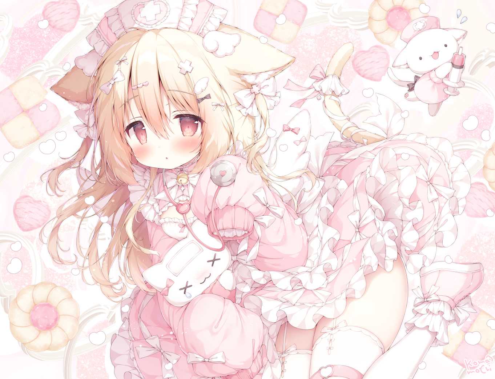

<div align="center">


<a href="https://github.com/Hotsteel2901">
  
</a>

<br/>


<br/><br/>



<br/><br/>

<a href="mailto:i.r.hotsteel@gmail.com">
  
</a>


<br/>


</div>

## `$ fastfetch`

```yaml
hotsteel@cachyos
────────────────────────────────────────
OS      · CachyOS Linux  (Arch-based, anime tuned)
Kernel  · linux-cachyos (BORE / performance)
Shell   · fish + bash
Editor  · vim (btw)
Code    · C (noob)  ·  Python (some)
Mood    · want to write code ♪
```

> ฅ^•ﻌ•^ฅ  nyaa~

## 🌸 Favorites

<div align="center">

| | |
|:--|:--|
| 💻 Language | C (noob) · Python (some) |
| 🐧 Distro | CachyOS · Arch Linux |
| ⌨️ Editor | Vim |
| 🐚 Shell | fish + bash |
| 🌸 Vibe | anime · lo-fi · Linux ricing |
| 📺 Watching | open to recs ♪ |

</div>

## 📈 Stats

<div align="center">
  
</div>

<div align="center">
  
</div>

<div align="center">
  
</div>

<div align="center">
  
</div>

<div align="center">
  <picture>
    <source media="(prefers-color-scheme: dark)" srcset="https://raw.githubusercontent.com/Hotsteel2901/Hotsteel2901/output/github-contribution-grid-snake-dark.svg">
    <source media="(prefers-color-scheme: light)" srcset="https://raw.githubusercontent.com/Hotsteel2901/Hotsteel2901/output/github-contribution-grid-snake.svg">
    
  </picture>
</div>

<div align="center">


</div>
